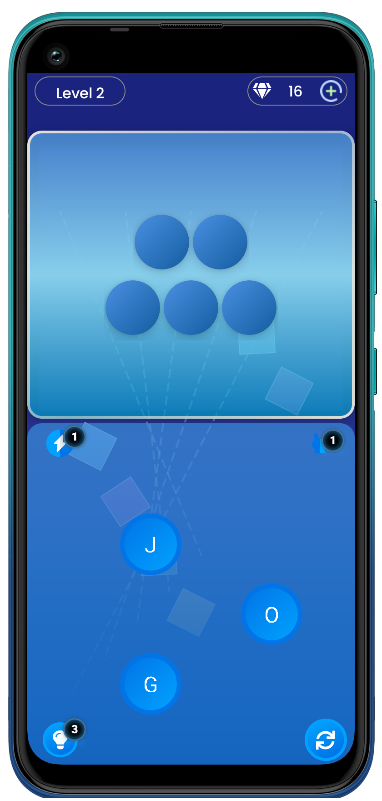
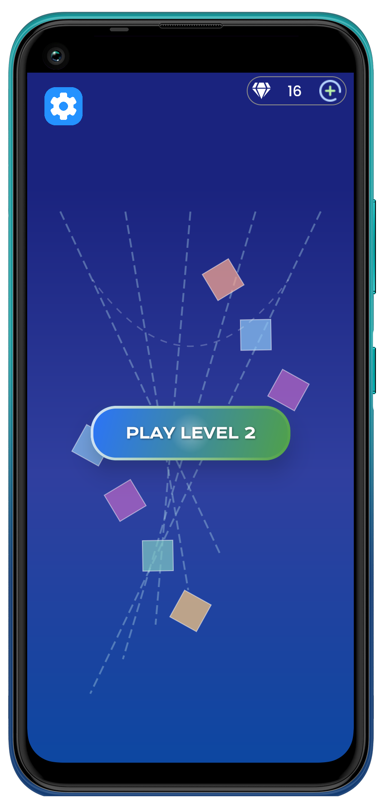
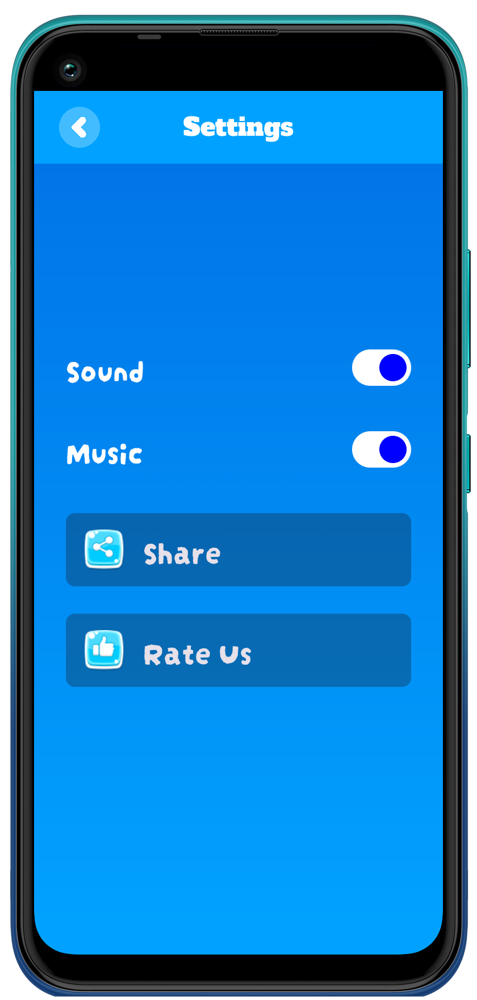
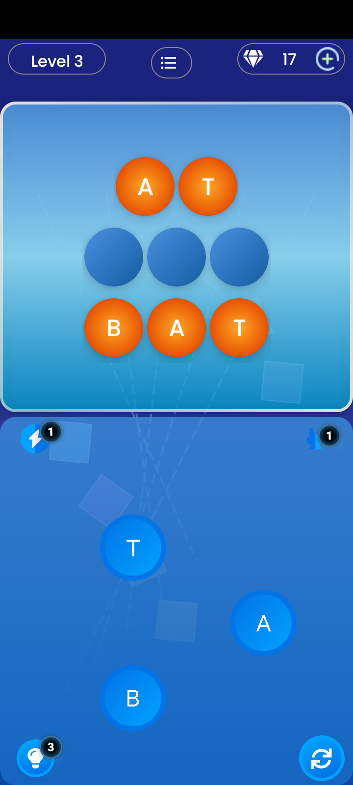
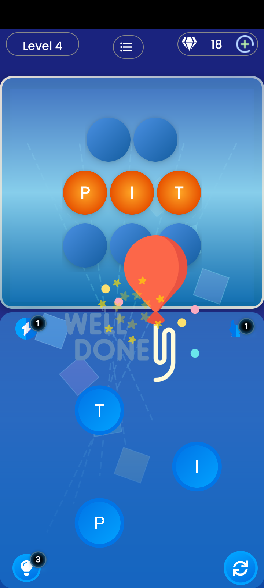

# Word Puzzle/Connect Game
A word puzzle game built with Jetpack Compose.

## About This Project
This project is a fork of the original [Word Connect Jetpack Compose](https://github.com/farimarwat/word-connect-jetpack-compose) by [Farimarwat](https://github.com/farimarwat). The game structure remains the same, but I have implemented several new features and UI improvements to enhance gameplay.

### New Features & Enhancements:
- **Quick Hint**: Instantly reveal an entire word as a hint.
- **Select Letter Hint**: Players can get a hint for a specific letter.
- **Theme & UI Overhaul**: Revamped design with improved visuals.
- **Discovered Word Meanings**: Players can now view the meanings of words they solve.
- **In-App Purchases (IAPs)**: Added support for purchasing hints and gems.
- **More Improvements Coming Soon!**

### Note:
The project is still in progress, and additional features and refinements are planned.

## How to Use
1. Clone the repository.
2. Open it in Android Studio.
3. Run the app on an emulator or physical device.

## Play Store Link
[Download on Google Play](https://play.google.com/store/apps/details?id=com.wordgame.wordpuzzles)

## Screenshots
Below are some screenshots from the game:

## Contribution
Everyone is welcome to contribute, but please modify all resources (e.g., images, audio) before publishing on the Play Store. The original brand "LexiLink" is copyrighted and must not be used in commercial releases.

## Credits
- **Original Project**: [Farimarwat's Word Connect](https://github.com/farimarwat/word-connect-jetpack-compose)

Stay tuned for updates!
